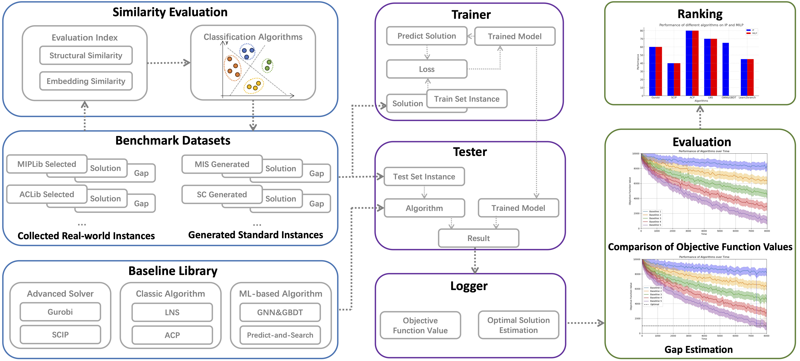

## ML4MILP

### Overview

ML4MILP is the first benchmark dataset specifically designed to test ML-based algorithms for solving MILP problems, consisting of three main components: Similarity Evaluation, Benchmark Datasets, and Baseline Library. Based on this structure, we conducted uniform training and testing of baseline algorithms, followed by a comprehensive evaluation and ranking of the results.

### Benchmark Datasets

We have meticulously assembled a substantial collection of mixed integer linear programming (MILP) instances from a variety of sources, including open-source, comprehensive datasets, domain-specific academic papers and competitions related to MILP.  Additionally, we generated a substantial number of standard problem instances based on four canonical MILP problems: the Maximum Independent Set (MIS) problem, the Minimum Vertex Covering (MVC) problem,  and the Set Covering (SC) problem. For each type of problem, we generated instances at three levels of difficulty—easy, medium, and hard.

The sizes of each categorized datasets are as follows, and the download links are detailed in './Benchmark Datasets/README.md'.

| Name(Path)                     | Number of Instances | Avg.Vars | Avg.Constrains |
| ------------------------------ | ------------------- | -------- | -------------- |
| MIS_easy                       | 50                  | 20000    | 60000          |
| MIS_medium                     | 50                  | 100000   | 300000         |
| MIS_hard                       | 50                  | 1000000  | 3000000        |
| MVC_easy                       | 50                  | 20000    | 60000          |
| MVC_medium                     | 50                  | 100000   | 300000         |
| MVC_hard                       | 50                  | 1000000  | 3000000        |
| SC_easy                        | 50                  | 40000    | 40000          |
| SC_medium                      | 50                  | 200000   | 200000         |
| SC_hard                        | 50                  | 2000000  | 2000000        |
| nn\_verification               | 3622                | 7144.02  | 6533.58        |
| item\_placement                | 10000               | 1083     | 195            |
| load\_balancing                | 10000               | 61000    | 64307.19       |
| anonymous                      | 138                 | 34674.03 | 44498.19       |
| HEM\_knapsack                  | 10000               | 720      | 72             |
| HEM\_mis                       | 10002               | 500      | 1953.48        |
| HEM\_setcover                  | 10000               | 1000     | 500            |
| HEM\_corlat                    | 1984                | 466      | 486.17         |
| HEM\_mik                       | 90                  | 386.67   | 311.67         |
| vary\_bounds\_s1               | 50                  | 3117     | 1293           |
| vary\_bounds\_s2               | 50                  | 1758     | 351            |
| vary\_bounds\_s3               | 50                  | 1758     | 351            |
| vary\_matrix\_s1               | 50                  | 802      | 531            |
| vary\_matrix\_rhs\_bounds\_s1  | 50                  | 27710    | 16288          |
| vary\_matrix\_rhs\_bounds\_obj | 50                  | 7973     | 3558           |
| vary\_obj\_s1                  | 50                  | 360      | 55             |
| vary\_obj\_s2                  | 50                  | 745      | 26159          |
| vary\_obj\_s3                  | 50                  | 9599     | 27940          |
| vary\_rhs\_s1                  | 50                  | 12760    | 1501           |
| vary\_rhs\_s2                  | 50                  | 1000     | 1250           |
| vary\_rhs\_s3                  | 50                  | 63009    | 507            |
| vary\_rhs\_s4                  | 50                  | 1000     | 1250           |
| vary\_rhs\_obj\_s1             | 50                  | 90983    | 33438          |
| vary\_rhs\_obj\_s2             | 50                  | 4626     | 8274           |
| Aclib                          | 99                  | 181      | 180            |
| Coral                          | 279                 | 18420.92 | 11831.01       |
| Cut                            | 14                  | 4113     | 1608.57        |
| ECOGCNN                        | 44                  | 36808.25 | 58768.84       |
| fc.data                        | 20                  | 571      | 330.5          |
| MIPlib                         | 50                  | 7719.98  | 6866.04        |
| Nexp                           | 77                  | 9207.09  | 7977.14        |
| Transportation                 | 32                  | 4871.5   | 2521.467       |

### Baseline Library

To validate the effectiveness of the proposed dataset, we organized the existing mainstream methods into a Baseline Library and conducted comparisons using Benchmark Datasets against these mainstream baselines. The algorithms in the Baseline Library are as follows. 

| Baseline                                                   | Code                                                         |
| ---------------------------------------------------------- | ------------------------------------------------------------ |
| Gurobi                                                     | ./Baseline Library/Gurobi_the_benchmark.py                   |
| SCIP                                                       | ./Baseline Library/SCIP_the_benchmark.py                     |
| Large Neighborhood Searc                                   | ./Baseline Library/LNS_the_benchmark.py                      |
| Adaptive Constraint Partition Based Optimization Framework | ./Baseline Library/ACP_the_benchmark.py                      |
| Learn to Branch                                            | [Link](https://github.com/ds4dm/learn2branch-ecole.git)      |
| GNN&GBDT-Guided Fast Optimizing Framework                  | [Link](https://github.com/thuiar/GNN-GBDT-Guided-Fast-Optimizing-Framework.git) |

### Similarity Evaluation